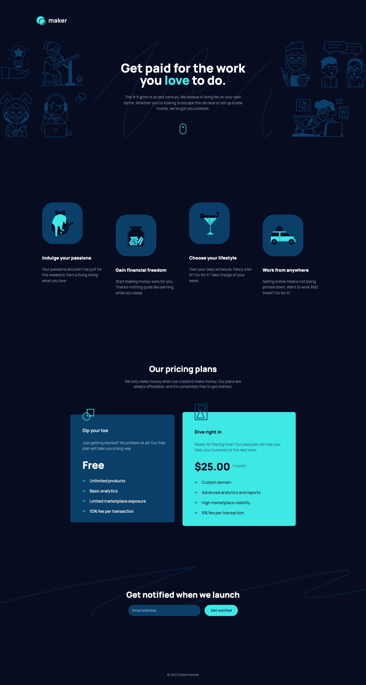

#  Maker pre-launch landing page

This is a solution to the [Maker pre-launch landing page challenge on Frontend Mentor](https://www.frontendmentor.io/challenges/maker-prelaunch-landing-page-WVZIJtKLd).

## Table of contents

- [Overview](#overview)
  - [The challenge](#the-challenge)
  - [Screenshot](#screenshot)
  - [Links](#links)
  - [Built with](#built-with)
  - [What I learned](#what-i-learned)
  - [Useful resources](#useful-resources)
- [Author](#author)

## Overview

This is a pre-launch landing page for a digital product called Maker. The design included 3 versions for mobile, tablet, and desktop views.

Users should be able to:

- View the optimal layout depending on their device's screen size
- See hover states for interactive elements
- Receive an error message when the form is submitted if the email is not formatted correctly: should show "Oops! That doesn’t look like an email address"

### The challenge

- Build out the project to the provided wireframe designs

### Screenshots

### Links

- Solution URL: [GitHub repo](https://github.com/k-monnik/maker-landing-page)
- Live Site URL: [Maker - Netlify](https://gregarious-smakager-02166e.netlify.app)

### Built with

- Semantic HTML5 markup
- JavaScript
- Flexbox
- CSS Grid
- Mobile-first workflow
- [Tailwind CSS](https://tailwindcss.com) - CSS framework

### What I learned

With this project, I continued to grow more comfortable using Tailwind, especially while implementing a responsive design with three different versions. I also enjoyed implementing the custom email validation message using JavaScript. I used the Tailwind forms plugin for the first time on this project and found that it made the form styling quite a bit more streamlined.

### Useful resources

- [Tailwind Forms plugin](https://github.com/tailwindlabs/tailwindcss-forms) - This plugin is really useful when styling forms with Tailwind and activates styling for state changes such as `focus` and `valid`/`invalid`.

## Author

- Website - [Kristen Monnik](https://www.monnik.dev)
- Frontend Mentor - [@k-monnik](https://www.frontendmentor.io/profile/k-monnik)
- Twitter - [@kmonnik_dev](https://twitter.com/kmonnik_dev)
- GitHub - [@k-monnik](https://github.com/k-monnik)
